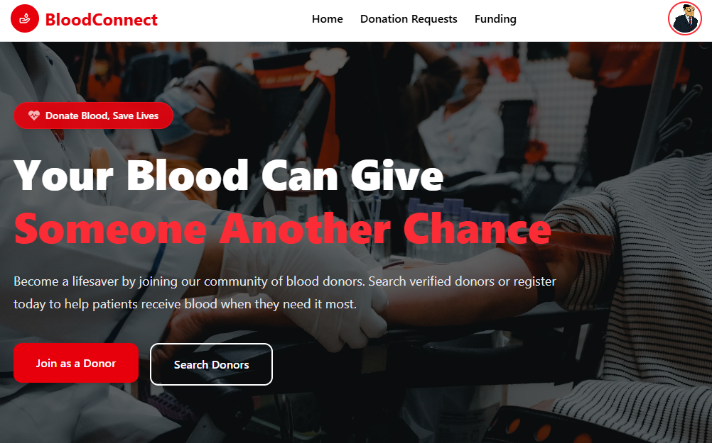

# 🩸 BloodConnect

BloodConnect is a modern blood donation management platform that connects blood donors with recipients in need. The platform simplifies the process of requesting blood, finding donors, managing donations, and supporting the organization through secure online funding.

## 📸 Screenshot



## 🌐 Live Website

**Client:** 
https://bloodconnect-client-eta.vercel.app
**Server:** 

---

## ✨ Features

- 🔐 Secure authentication with **Better Auth** (Email/Password & Google Sign-In).
- 🩸 Create, update, and manage blood donation requests.
- 👨‍⚕️ Search blood donors by blood group and location.
- 💳 Donate securely using **Stripe Checkout**.
- 👤 Role-based dashboard for **Admin**, **Donor**, and **Volunteer**.
- 📊 Dashboard statistics and funding overview.
- 🖼️ Image upload support using ImgBB.
- 📱 Fully responsive UI built with Tailwind CSS and HeroUI.
- 🔒 Protected routes based on user roles.
- ⚡ Fast performance with Next.js App Router.

---

## 🛠️ Technologies Used

### Frontend

- Next.js 16
- React 19
- Tailwind CSS
- HeroUI
- Better Auth Client
- Axios
- React Icons
- Lucide React

### Backend

- Node.js
- Express.js
- MongoDB
- Better Auth
- Stripe API
- ImgBB API
- dotenv
- CORS

---

---

## 🚀 Installation

### Clone the repository

```bash
git clone https://github.com/ssdevcmd/a10-bloodconnect-client
```

```bash
git clone https://github.com/ssdevcmd/a10-bloodconnect-server

---

### Install dependencies

```bash
npm install
```

---

### Run the client

```bash
npm run dev
```

---

### Run the server

```bash
npm start
```

---

## 👥 User Roles

### 🩸 Donor

- Register/Login
- Create donation requests
- Update request status
- View donation history
- Make funding donations

### 🤝 Volunteer

- Manage donation requests
- Update request status
- Assist donors

### 👑 Admin

- Manage all users
- Promote/Demote roles
- Manage funding records
- View dashboard analytics
- Control platform activities

---

## 💳 Payment Integration

This project uses **Stripe Checkout** for secure online donations.

---

## 📸 Image Hosting

User profile images are uploaded using **ImgBB API**.

---

## 🔒 Authentication

Authentication is handled by **Better Auth** with:

- Email & Password
- JWT Session Strategy
- Role-Based Authorization

---

## 📈 Future Improvements

- Real-time donor availability
- Blood donation event management
- Advanced search filters


---
